# Split Bill Application

This repository contains AI-based application for splitting-bill, written on python (streamlit) and can be run on your local computer.

Courtesy of: https://github.com/MukhlasAdib

## Features

With this application, you can upload a photo of your receipt. The AI will read the receipt and show you the data.

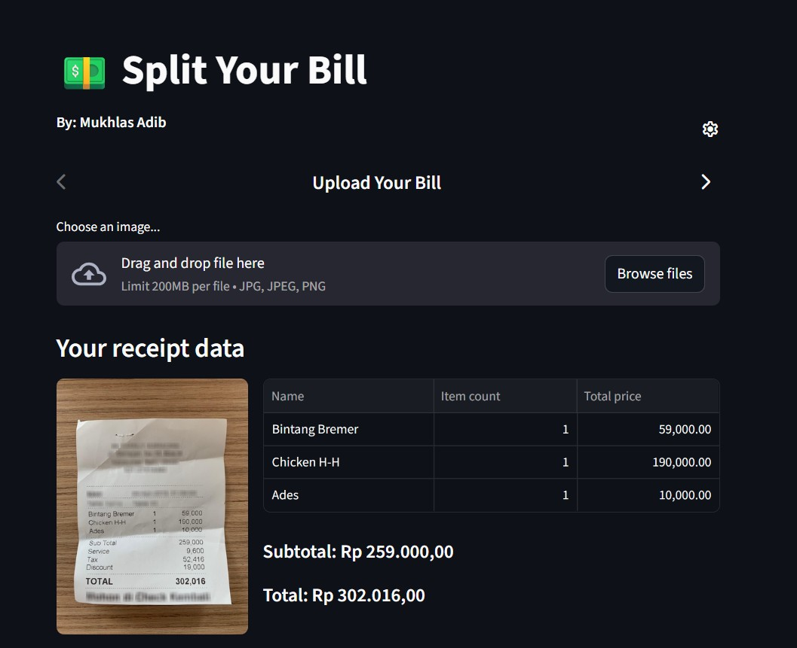

Then, you can list participants of your split-bill, and then assign items from the receipt to each of them.

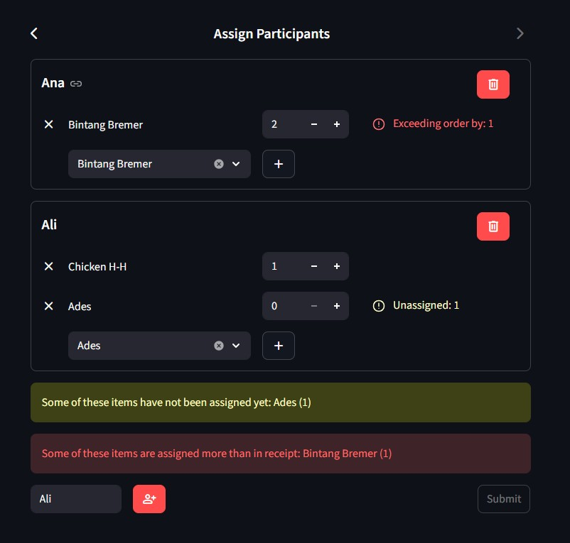

When you are done, final report will be shown.

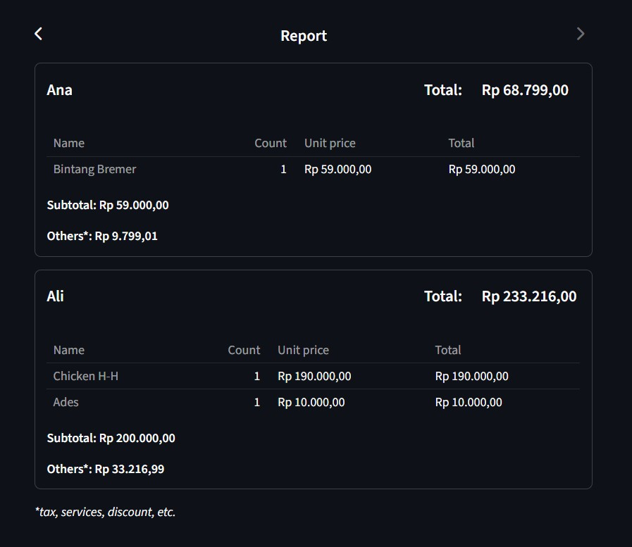

## Installation

1. Make sure Python is installed (any recent version should be fine, I tested with Python 3.12)
2. Create environment for this application

with virtualenv:

```bash
    pip install virtualenv
    python -m virtualenv .ven
```

with uv:

```bash
    uv sync
```

3. Activate the environment

if using Linux

```bash
    source .venv/bin/activate
```

if using Windows

```powershell
    .\.venv\Scripts\activate
```

4. Install required libraries

with virtualenv:

```bash
    pip install -r requirements.txt
```

with uv:

```bash
    uv sync
```

## Run Application

1. Activate the environment

if using Linux

```bash
    source .venv/bin/activate
```

if using Windows

```powrshell
    .\.venv\Scripts\activate
```

2. Start the app

with virtualenv:

```bash
    streamlit run app.py
```

with uv:

```bash
    uv run streamlit run app.py
```

# ANALISIS

## Analisis Awal

|   Feature    |    TrOCR     |         Donut          |
| :----------: | :----------: | :--------------------: |
|    Tujuan    |     OCR      | Document Understanding |
|    Output    |     Text     |    Structured JSON     |
|    Speed     | Lebih Cepat  |      Lebih Lambat      |
|  Detection   |      x       |        implicit        |
| Akurasi Teks | Sangat Bagus |      Kadang Miss       |
|   Parsing    |    Manual    |        Otomatis        |
|   Training   |    mudah     |      Lebih sulit       |
|   Pipeline   |   Complex    |         Simple         |

## Result

|   Feature    |                                      TrOCR                                      |                 Donut                  |
| :----------: | :-----------------------------------------------------------------------------: | :------------------------------------: |
|    Output    |                      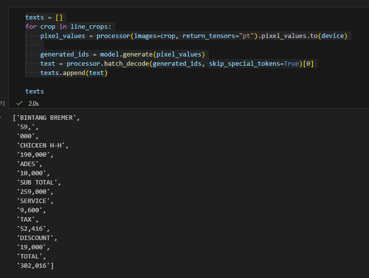                       |  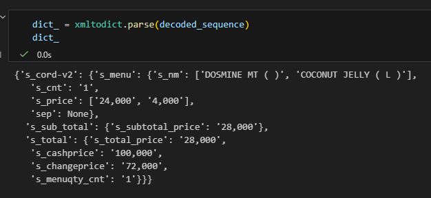  |
|    Speed     |                        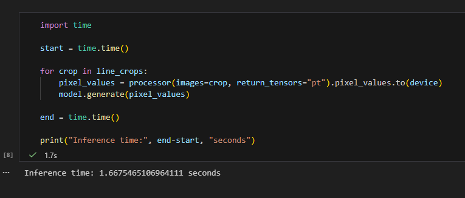                         |    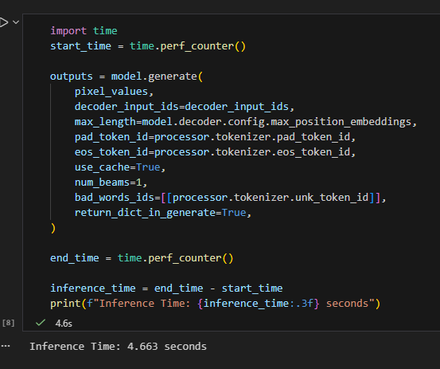    |
|  Detection   |                   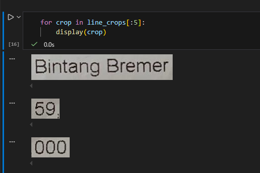                    |                implicit                |
| Akurasi text | 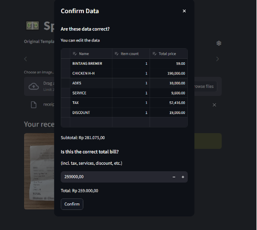 <br> Bergantung Detection yang digunakan | 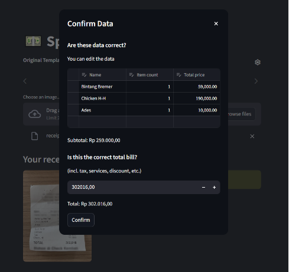 |
|   parsing    |                     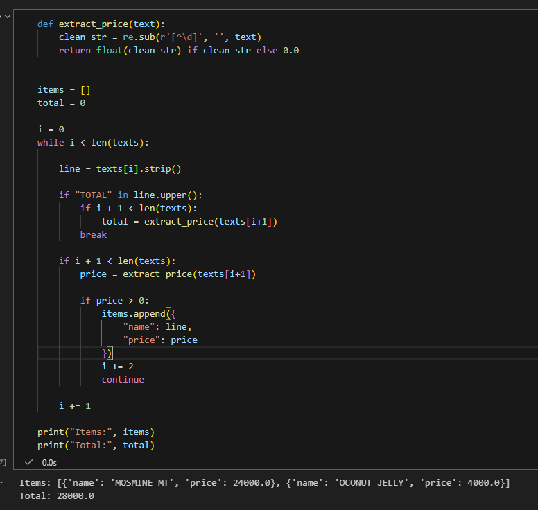                      |                otomatis                |

## Analisis model

Kedua model memiliki kekurangan dan kelebihan masing masing. Keunggulan utama TrOCR adalah kecepatan inference yang lebih tinggi, sehingga cocok digunakan pada pipeline OCR yang membutuhkan efisiensi. Sebaliknya, Donut dirancang untuk langsung menghasilkan struktur data dari gambar dokumen tanpa melalui tahap OCR terpisah. Model ini dapat mengubah gambar struk secara langsung menjadi format terstruktur seperti JSON atau XML yang berisi informasi item, jumlah, harga, dan total. Pendekatan ini membuat proses ekstraksi informasi menjadi lebih sederhana karena tidak memerlukan tahap parsing tambahan. Namun, hasil pengujian menunjukkan bahwa model Donut memiliki beberapa keterbatasan seperti kemungkinan munculnya kesalahan parsing ketika struktur output berbeda dari yang diharapkan, serta waktu inference yang lebih lama dibandingkan TrOCR.

## Analisis aplikasi

Secara fitur aplikasi sudah sangat baik sesuai dengan fungsi nya yaitu split bill. namun masih terdapat beberapa bug antara lain:

1. Error saat upload struk model Donut (hanya beberapa case)

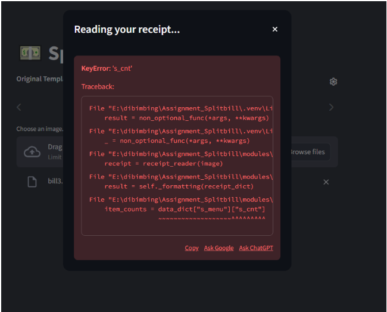<br>
model tidak menghasilkan field s_cnt pada beberapa struk sehingga terdapat error seperti diatas.

2. Menambah tombol finish (saran)

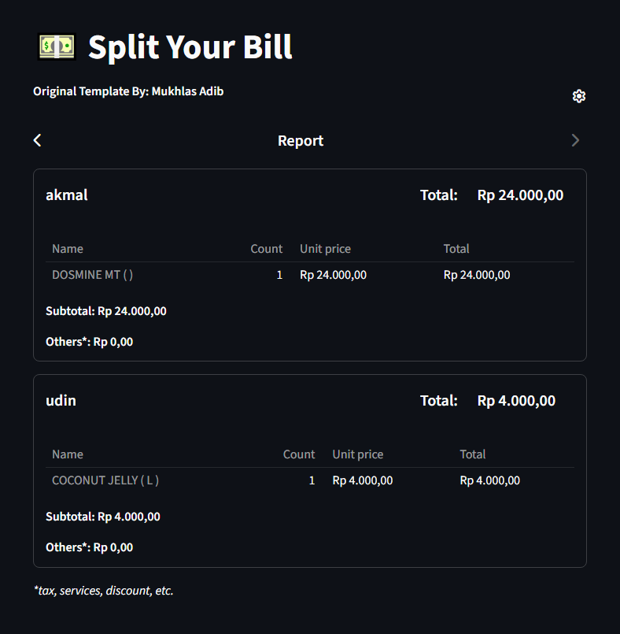<br>
Menambah button finish untuk reset agar aplikasi bisa digunakan dari awal kembali

## Analisis akhir

Produk aplikasi SplitBill yang dikembangkan sudah berjalan dengan baik secara fungsional. Aplikasi ini mampu memproses gambar struk dan mengekstraksi informasi item serta total harga menggunakan teknologi OCR. Salah satu keunggulan dari aplikasi ini adalah fleksibilitas dalam pemilihan model OCR, seperti penggunaan TrOCR untuk text recognition dan Donut sebagai model end-to-end document understanding.

Dengan adanya pilihan beberapa model, pengguna dapat menyesuaikan metode yang digunakan berdasarkan kebutuhan, baik dari segi akurasi maupun kecepatan pemrosesan. Selain itu, sistem juga mampu melakukan parsing hasil OCR menjadi data terstruktur sehingga memudahkan proses pembagian tagihan (split bill).

Secara keseluruhan, aplikasi ini telah berhasil mengintegrasikan proses deteksi teks, pengenalan teks, serta pengolahan data menjadi satu alur kerja yang dapat digunakan secara praktis untuk membantu pengguna membagi tagihan dari gambar struk.

## Link Video Demo

https://drive.google.com/file/d/1sMlthN00rKIDJ6z04T4zRoGrORsvrPsX/view?usp=sharing
